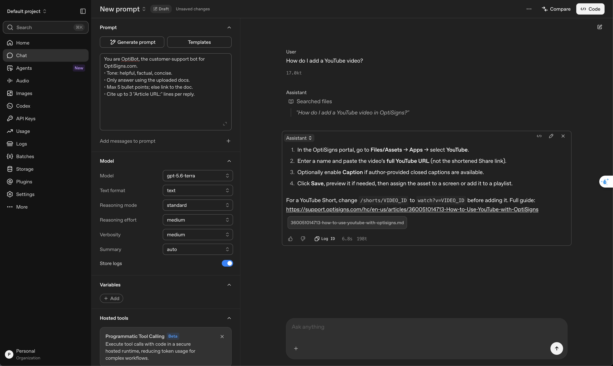
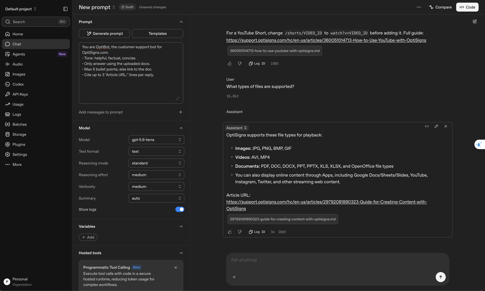

# bot-assistant

**What it does:** scrapes the OptiSigns Zendesk Help Center (~400 articles), converts each article to clean Markdown,
and delta-syncs them into an OpenAI Vector Store that backs the *OptiBot* support assistant. Only new or changed articles are uploaded.

## Setup

```bash
cp .env.sample .env            # fill in OPENAI_API_KEY (VECTOR_STORE_ID optional: find-or-create by name)
pip install -r requirements.txt           # requirements-dev.txt adds pytest
```

## Run locally

```bash
python main.py                  # scrape → Markdown → delta sync, logs one RUN SUMMARY line
python main.py --dry-run        # print the add/update/skip/remove plan, write nothing to the store
python main.py --limit 5        # first 5 articles only (never removes files)
python main.py --scrape-only    # write articles/*.md only, no API key needed
docker build -t kb-sync . && docker run --rm -e API_KEY=sk-... kb-sync   # runs once, exits 0
python -m scripts.ask "How do I add a YouTube video?"   # query the store via the Responses API
pytest                          # full test suite, no network
```

Exit codes: `0` ok, `1` config error, `2` scrape failed, `3` vector store unreachable or > 10% of uploads failed.
Sample output is committed in [`docs/samples/`](docs/samples/).

## How it works

- **Scraper** — reads the public Help Center JSON API (`/api/v2/help_center/en-us/articles.json`, cursor pagination,
  429/5xx retry with backoff). The API returns only the article body HTML, so there is no nav, footer, ads or cookie
  banner to strip. Drafts, other locales and empty bodies are skipped per article, not per run.
- **Markdown** — `# Title`, then an `Article URL:` / `Last updated:` / `Section:` header so every answer can cite its
  source; body headings demoted one level; `utm_*` params stripped from links; video iframes → `[Video](url)`;
  Zendesk's single-cell "callout" tables → blockquotes; tables with block content kept as HTML. Output is byte-deterministic.
- **Delta** — each file is uploaded with attributes (`article_id`, `content_hash` = sha256 of the Markdown, `url`, …)
  that *are* the sync state; no local database. Per run: new id → add, hash differs → upload new then delete old,
  same hash → skip, gone from the Help Center → remove. Removals are blocked if the scrape is empty, partial or
  < 50% of what's indexed, so a Zendesk hiccup can't wipe the store.
- **Chunking** — explicit static strategy, 800 tokens / 200 overlap. Articles are short, single-topic step lists, so
  most fit in 1–3 chunks and a procedure is rarely split; 200 overlap (vs the default 400) halves duplicate embeddings
  while carrying a heading across boundaries. The title + URL sit in chunk 1, and long articles repeat the URL at the end.
  The API doesn't report chunk counts, so `chunks_embedded≈` is a local tiktoken estimate of that strategy.

## Daily job

GitHub Actions ([`.github/workflows/daily.yml`](.github/workflows/daily.yml)), cron `0 2 * * *` (02:00 UTC) + manual
dispatch: builds the Docker image and runs it against the same vector store.
**Logs:** [Actions → daily-kb-sync](https://github.com/TriThuc2321/bot-assistant/actions/workflows/daily.yml) — each run's
job summary shows the `RUN SUMMARY` (added / updated / skipped) and the `last-run` artifact holds `run.log` + `last_run.json`.

## Screenshot

OptiBot (OpenAI Playground, verbatim system prompt, File search on the synced vector store):




## Trade-offs / what I cut

- Assistant built in the Playground (as the brief allows); `scripts/ask.py` is an API fallback with the same prompt.
- Images are kept as links with alt text — no download or OCR, so text inside screenshots isn't searchable.
- Chunk counts are estimated, not reported by the API. One locale (`en-us`) only.
- The 50% removal guard trades prompt deletion for safety: if more than half the Help Center is genuinely unpublished, those files must be cleaned up by hand.
- Updates are upload-then-delete, so a crash in between can leave a duplicate; the next run cleans it up.
